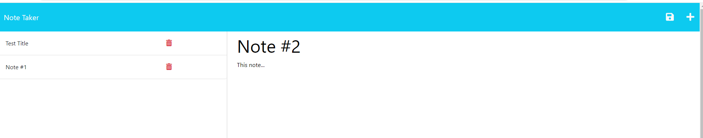

# 11 Express.js: Note Taker

# Express.js Note Taker

## Description/What I attempted to do

Added code to the Note Taker application that allows users to enter, save and delete notes. I built this create a list of notes or reminders. As part of this project, I learned how to use Express.js routes for GET, POST, PUT and DELETE to connect the front end and back end of an application.

## Table of Contents

### [Usage](#usage)

### [License](#license)

### [Contributing](#contributing)

### [Questions](#questions)

## Usage

Click the Get Started button on the home page. This takes you to the notes page, where you can see existing notes, enter new notes, and delete notes. To enter a new note, type the title where it says "Note Title". Under that, enter the text of the note where it says "Note Text." Then click the save icon in the upper right hand corner. Your note will be added to the list of notes on the left hand side. To delete a note, click on the trash can icon that is on the line of the note you want to delete on the left side of the screen.

## License

The license for this project is MIT and the link for license information is https://opensource.org/licenses/MIT.

## Contributing/Acknowledgements

Tips from University of Minnesota Full Stack Bootcamp instructor Gary Almes and notes from class sessions.

Tips from tutoring session with Alexis San Javier through University of Minnesota coding boot camp.

Information on npm website for uuid package located here: https://www.npmjs.com/package/uuid

## Questions

Please find more information at my GitHub, located [here](https://github.com/Jacqueline-Stiehl).
If you have additional questions, please contact me at salsajackie@yahoo.com.

## Screen shot

## Link to the working version of the code

https://github.com/Jacqueline-Stiehl/express-js-note-taker-jstiehl

## URL of deployed application

https://jacqueline-stiehl.github.io/express-js-note-taker-jstiehl/

## Heroku

Heroku app name: note-taker-jstiehl: https://note-taker-jstiehl-df68c54ee51b.herokuapp.com/
